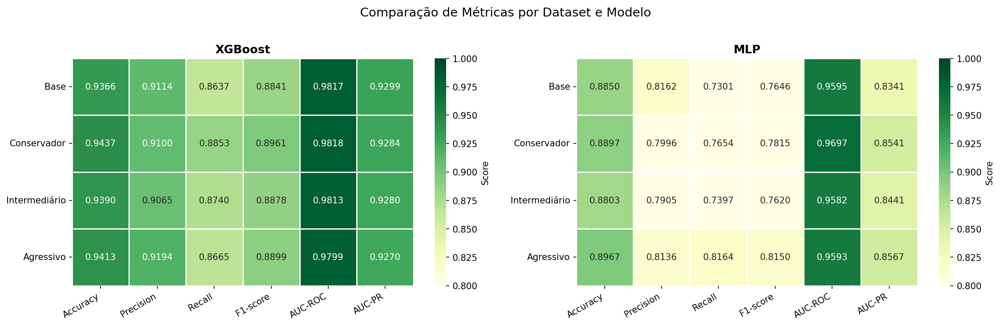
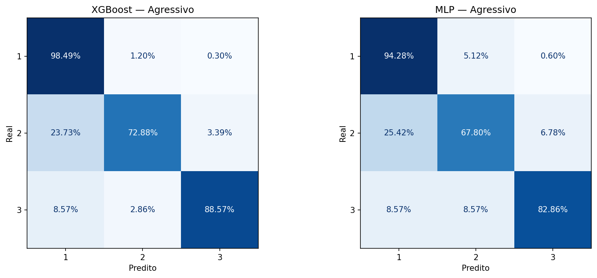

# Fetal Health Classification

Classificação da saúde fetal a partir de exames de cardiotocografia (CTG), comparando **XGBoost** e **MLP** em quatro conjuntos de features com diferentes níveis de seleção.

## Objetivo

Classificar cada exame em uma de três classes:

| Classe | Significado   |
|--------|---------------|
| 1      | Normal        |
| 2      | Suspeito      |
| 3      | Patológico    |

Do ponto de vista clínico, o erro mais crítico é prever "normal" para um feto que é **patológico**.

## Dataset

- 2126 exames, 21 features numéricas + variável alvo `fetal_health`.
- Classes desbalanceadas: ~77,8% normal, ~13,9% suspeito, ~8,3% patológico.
- Fonte: `Data/fetal_health_base.xlsx`.

## Estrutura do projeto

```
.
├── Data/
│   ├── fetal_health_base.xlsx          # dados originais
│   ├── fetal_health_base_limpa.csv     # dados após tratamento
│   ├── dados_conservador.csv           # 19 features
│   ├── dados_intermediario.csv         # 17 features
│   └── dados_agressivo.csv             # 14 features
├── EDA_preprocessing/
│   └── EDA_dataset.ipynb               # limpeza, análise exploratória e seleção de features
├── Machine_learning/
│   └── Models.ipynb                    # treino, tuning e avaliação dos modelos
├── Figures/
│   ├── heatmap_comparacao.png
│   └── matriz_confusao_agressivo.png
└── requirements.txt
```

## Metodologia

### 1. Pré-processamento e EDA (`EDA_dataset.ipynb`)
- Duas colunas (`mean_value_of_short_term_variability` e `mean_value_of_long_term_variability`) foram lidas como datas/objetos; os valores foram convertidos para `float` (datas substituídas por 0).
- Outliers foram **mantidos**, pois podem ser indicativos da classe patológica.
- Importância das features avaliada por `SelectKBest` (ANOVA F), importância de árvore de decisão, informação mútua e matriz de correlação.

### 2. Datasets por seleção de features
| Dataset       | Nº features | Removidas (cumulativo) |
|---------------|-------------|------------------------|
| Base          | 21          | —                      |
| Conservador   | 19          | `histogram_number_of_zeroes`, `mean_value_of_long_term_variability` |
| Intermediário | 17          | + `severe_decelerations`, `histogram_number_of_peaks` |
| Agressivo     | 14          | + `histogram_mode`, `histogram_median`, `light_decelerations` (histogramas altamente correlacionados) |

### 3. Modelagem (`Models.ipynb`)
- Split treino/teste estratificado 80/20 (1700 / 426), `random_state=42`.
- **XGBoost** (`multi:softprob`) e **MLP** (com `StandardScaler`, early stopping).
- Tuning com `RandomizedSearchCV` + `StratifiedKFold` (5 folds), otimizando `f1_macro` (50 iterações para XGBoost, 30 para MLP).
- Métricas: Accuracy, Precision, Recall, F1 (macro), AUC-ROC e AUC-PR.

## Resultados (conjunto de teste)

| Dataset       | Modelo  | Accuracy | Precision | Recall | F1     | AUC-ROC | AUC-PR |
|---------------|---------|----------|-----------|--------|--------|---------|--------|
| Base          | XGBoost | 0.9366   | 0.9114    | 0.8637 | 0.8841 | 0.9817  | 0.9299 |
| Base          | MLP     | 0.8850   | 0.8162    | 0.7301 | 0.7646 | 0.9595  | 0.8341 |
| Conservador   | XGBoost | 0.9437   | 0.9100    | 0.8853 | 0.8961 | 0.9818  | 0.9284 |
| Conservador   | MLP     | 0.8897   | 0.7996    | 0.7654 | 0.7815 | 0.9697  | 0.8541 |
| Intermediário | XGBoost | 0.9390   | 0.9065    | 0.8740 | 0.8878 | 0.9813  | 0.9280 |
| Intermediário | MLP     | 0.8803   | 0.7905    | 0.7397 | 0.7620 | 0.9582  | 0.8441 |
| Agressivo     | XGBoost | 0.9413   | 0.9194    | 0.8665 | 0.8899 | 0.9799  | 0.9270 |
| Agressivo     | MLP     | 0.8967   | 0.8136    | 0.8164 | 0.8150 | 0.9593  | 0.8567 |



### Conclusões
- **XGBoost supera a MLP** em todos os datasets.
- O melhor XGBoost foi no dataset Conservador, mas o Agressivo (14 features) teve desempenho muito próximo; ele foi escolhido por ser mais simples e com maior potencial de generalização.
- Para a MLP, o Agressivo também foi o melhor, pois a remoção de features reduziu ruído.
- Há confusão esperada entre as classes normal e suspeito (um feto suspeito pode ser saudável). O mais importante é identificar corretamente os casos patológicos.



## Como executar

```bash
python -m venv venv
source venv/bin/activate
pip install -r requirements.txt
jupyter notebook
```

Execute os notebooks nesta ordem (os caminhos são relativos à pasta de cada notebook):

1. `EDA_preprocessing/EDA_dataset.ipynb` — gera os CSVs em `Data/`.
2. `Machine_learning/Models.ipynb` — treina os modelos e gera as figuras em `Figures/`.

> O `requirements.txt` não lista `scipy` nem `jupyter`; eles são necessários para rodar os notebooks (`scipy` costuma vir como dependência do scikit-learn).
